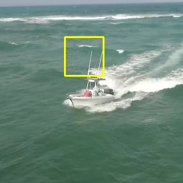

# TODO
对模板、搜索图像补丁区域的 Y 进行攻击。涉及较少区域，希望不被发现。且作用是标识要跟什么物体，比较重要。
对模板、搜索图像全域的 CbCr 进行攻击。希望改变整体图像的色调。（以前可视化过，就算全图攻击了CbCr，变化也是可以忍受的。）
与先前方法比较，我们在2个通道上进行了全图部署，供给面更广了，希望取得更好的效果。
改训练代码。
    保存扰动。
改测试代码。
    读取扰动。

# 实验环境
157，pytorch1.8_python3.9

# 训练命令
python main/train.py

# 训练结果
cls: 0.202, ctr: 0.565, reg: 0.796, x: 97.19, z: 37.79, iou: 0.800, data: 1.5e-01, fwd: 9.0e-01, 
 save to: /home/yyshi/zhbli/projects/Universal-Targeted-Attacks-for-Siamese-Visual-Tracking/snapshots_imperceptible_patch/64/x_512_CbCr /home/yyshi/zhbli/projects/Universal-Targeted-Attacks-for-Siamese-Visual-Tracking/snapshots_imperceptible_patch/64/z_512

 # 测试命令
 python main/test.py
 采用 512 次迭代。

 # 测试结果
 使用 main/eval_origin.py 获得。AO=0.22. 若删除背景，AO=0.315.

 # 扰动可视化
 

 

 搜索图像中64*64补丁的SSIM（灰色背景）为0.38。

 # 结论
 对模板、搜索图像补丁区域的 Y 进行攻击。对模板、搜索图像全域的 CbCr 进行攻击。untargeted_AO=0.22, SSIM_灰色背景=0.38.