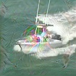
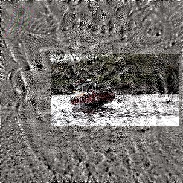

# 不对补丁 CbCr 加约束，对背景 Y 加约束

cls: 0.079, ctr: 0.557, reg: 0.549, x: 3.85, z: 33.63, iou: 0.848, data: 1.5e-01, fwd: 8.8e-01, save to: /home/yyshi/zhbli/projects/Universal-Targeted-Attacks-for-Siamese-Visual-Tracking/snapshots_imperceptible_patch/64/x_512_CbCr /homehbli/projects/Universal-Target/yyshi/zhbli/projects/Universal-Targeted-Attacks-for-Siamese-Visual-Tracking/snapshots_imperceptible_patch/64/z_512

SSIM=0.41, AO=0.148

# 对补丁 CbCr 加约束，不对背景 Y 加约束。

cls: 0.131, ctr: 0.566, reg: 0.845, x: 80.79, z: 35.04, iou: 0.786, data: 1.5e-01, fwd: 8.9e-01,  max mem: 7074.1M: save to: /home/yyshi/zhbli/projects/Universal-Targeted-Attacks-for-Siamese-Visual-Tracking/snapshots_imperceptible_patch/64/x_512_CbCr /home/yyshi/zhbli/projects/Universal-Targeted-Attacks-for-Siamese-Visual-Tracking/snapshots_imperceptible_patch/64/z_512
 

SSIM=0.42, AO=0.164

# 对补丁 CbCr 加4倍约束，不对背景 Y 加约束。

## 512

cls: 0.250, ctr: 0.586, reg: 1.203, x: 27.98, z: 33.93, iou: 0.717, data: 1.7e-01, fwd: 8.8e-01,  max mem: 7074.1M: save to: /home/yyshi/zhbli/projects/Universal-Targeted-Attacks-for-Siamese-Visual-Tracking/snapshots_imperceptible_patch/64/x_512_CbCr /home/yyshi/zhbli/projects/Universal-Targeted-Attacks-for-Siamese-Visual-Tracking/snapshots_imperceptible_patch/64/z_512

SSIM_z=0.56, SSIM_x=0.60, AO=0.255

## 1024

cls: 0.200, ctr: 0.582, reg: 0.971, x: 25.23, z: 39.11, iou: 0.760, data: 1.6e-01, fwd: 8.9e-01,  max mem: 7074.1M:    save to:/home/yyshi/zhbli/projects/Universal-Targeted-Attacks-for-Siamese-Visual-Tracking/snapshots_imperceptible_patch/64/x_1024_CbCr /home/yyshi/zhbli/projects/Universal-Targeted-Attacks-for-Siamese-Visual-Tracking/snapshots_imperceptible_patch/64/z_1024

# 对模板加4倍约束，对补丁CbCr加4倍约束，不对背景Y加约束。

## 4096次迭代
cls: 0.189, ctr: 0.573, reg: 0.826, x: 17.50, z: 10.91, iou: 0.781, data: 1.3e-01, fwd: 8.8e-01,  max mem: 7074.1M:   0%| | 4095 save to: /home/yyshi/zhbli/projects/Universal-Targeted-Attacks-for-Siamese-Visual-Tracking/snapshots_imperceptible_patch/64/x_4096_CbCr /home/yyshi/zhbli/projects/Universal-Targeted-Attacks-for-Siamese-Visual-Tracking/snapshots_imperceptible_patch/64/z_4096

SSIM=0.43

## 32768次迭代
cls: 0.113, ctr: 0.556, reg: 0.616, x: 14.25, z: 8.48, iou: 0.823, data: 1.8e-01, fwd: 8.9e-01,  max mem: 7074.1M:   0%| | 32767 save to: /home/yyshi/zhbli/projects/Universal-Targeted-Attacks-for-Siamese-Visual-Tracking/snapshots_imperceptible_patch/64/x_32768_CbCr /home/yyshi/zhbli/projects/Universal-Targeted-Attacks-for-Siamese-Visual-Tracking/snapshots_imperceptible_patch/64/z_32768

SSIM=0.1

