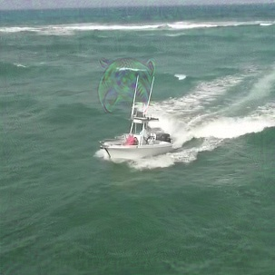

# 实验环境
157，pytorch1.8_python3.9

# 训练命令
python main/train.py

# 训练结果
cls: 0.263, ctr: 0.579, reg: 1.042, x: 55.63, z: 37.58, iou: 0.754, data: 1.5e-01, fwd: 8.9e-01,  max mem: 7075. save to: /home/yyshi/zhbli/projects/Universal-Targeted-Attacks-for-Siamese-Visual-Tracking/snapshots_imperceptible_patch/64/x_512_CbCr /home/yyshi/zhbli/projects/Universal-Targeted-Attacks-for-Siamese-Visual-Tracking/snapshots_imperceptible_patch/64/z_512

# 测试命令
python main/test.py
512 次迭代。

# 测试结果
SSIM=0.45, AO=0.291

