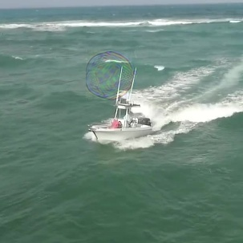

对扰动加不同的旋转和翻转，结果仍有一定的攻击性能（untargeted=0.15->0.58(不攻击时是0.76)）

FGT_AO               FGT_SR               GT_AO               GT_SR

0.33406025948718326, 0.33086467250168317, 0.5840040599598443, 0.6770222179474849

