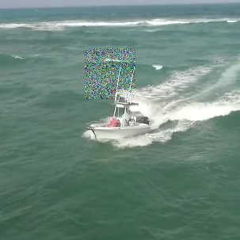

# MEAN=0_STD=1
FGT_AO
0.14182406222637045

FGT_SR
0.10099067038568818

GT_AO
0.759663623158611

GT_SR
0.8958834279118977

# MEAN=0_STD=10
FGT_AO FGT_SR GT_AO GT_SR

0.14302326420431755, 0.10151966913532749, 0.7611005793337838, 0.8977108781379244

# MEAN=10_STD=10
0.1426013941015058, 0.10089448879484467, 0.7606306846685555, 0.8975185149562374

# MEAN=0_STD=50
0.14416121288960623, 0.10123112436279696, 0.7399641485034817, 0.8753486582668077

# MEAN=50_STD=50
0.14545952289073974, 0.10214484947581033, 0.7330842768281701, 0.8682793113398095

# MEAN=0_STD=100
0.15152003389319688, 0.11214773492353564, 0.715110969879408, 0.8503414446474945

# MEAN=200_STD=200
0.16091335527606107, 0.12575743002789266, 0.6616592438632791, 0.7768587092430509

